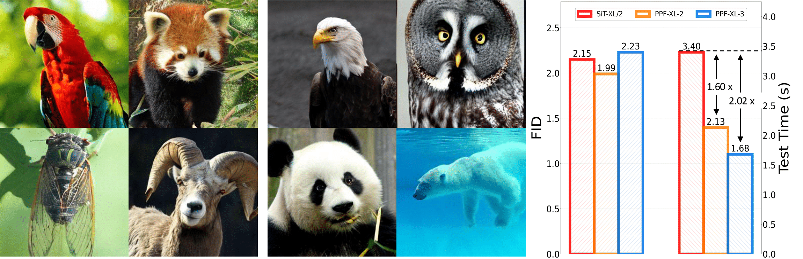

## Pyramidal Patchification Flow for Visual Generation (PPFlow)<br><sub>Official PyTorch Implementation</sub>

### [Paper](https://arxiv.org/pdf/2506.23543) 



This repo contains PyTorch model definitions, pre-trained weights and training/sampling code for our paper Pyramidal Patchification Flow for Visual Generation (PPFlow). 

<h1 align='center'>Pyramidal Patchification Flow for Visual Generation</h1>
<div align='center'>
    <a href='https://scholar.google.com/citations?user=QeQnG7IAAAAJ&hl=zh-CN' target='_blank'>Hui Li</a><sup>1</sup>&emsp;
    <a href='https://github.com/cbyzju' target='_blank'>Baoyou Chen</a><sup>3</sup>&emsp;
    <a href='https://github.com/AricGamma' target='_blank'>Liwei Zhang</a><sup>3</sup>&emsp;
    <a href='https://github.com/Studentxll' target='_blank'>Jiaye Li</a><sup>1</sup>&emsp;
</div>
<div align='center'>
    <a href='https://jingdongwang2017.github.io/' target='_blank'>Jingdong Wang</a><sup>2</sup>&emsp;
    <a href='https://sites.google.com/site/zhusiyucs/home' target='_blank'>Siyu Zhu</a><sup>1,3</sup>&emsp;
</div>
<div align='center'>
    <sup>1</sup>Fudan University&emsp; <sup>2</sup>Baidu Inc&emsp; <sup>3</sup>Shanghai Academy of AI for Science
</div>
<br>


Diffusion transformers (DiTs) adopt Patchify, mapping patch representations to token representations through linear projections, to adjust the number of tokens input to DiT blocks and thus the computation cost. Instead of a single patch size for all the timesteps, we introduce a Pyramidal Patchification Flow (PPFlow) approach: Large patch sizes are used for high noise timesteps and small patch sizes for low noise timesteps; Linear projections are learned for each patch size; and Unpatchify is accordingly modified. Unlike Pyramidal Flow, our approach operates over full latent representations other than pyramid representations, and adopts the normal denoising process without requiring the renoising trick. We demonstrate the effectiveness of our approach through two training manners.  Training from scratch achieves 
a $1.6\times$ ($2.0\times$) inference speed over SiT-B/2 for $2$-level ($3$-level) pyramid patchification with slightly lower training FLOPs and similar image generation performance. Training from pretrained normal DiTs achieves even better performance with small training time.

This repository contains:

* Pre-trained class-conditional PPFlow models trained on ImageNet 256x256
* A PPFlow [training script](train.py) using PyTorch DDP

## Setup

First, download and set up the repo:

```bash
git clone https://github.com/fudan-generative-vision/PPFlow.git
cd PPFlow
```

We provide an [`environment.yml`](environment.yml) file that can be used to create a Conda environment. If you only want 
to run pre-trained models locally on CPU, you can remove the `cudatoolkit` and `pytorch-cuda` requirements from the file.

```bash
conda env create -f environment.yml
conda activate PPFlow
```

**Pre-trained PPFlow checkpoints.** You can sample from our pre-trained models with [`sample.py`](sample.py). Weights for our pre-trained model will be 
automatically downloaded depending on the model you use. The script has various arguments to adjust sampler configurations (ODE & SDE), sampling steps, change the classifier-free guidance scale, etc. For example, to sample from
our 256x256 PPFlow-XL-2 model with default ODE setting, you can use:

```bash
python sample.py ODE --image-size 256 --seed 1
```

Our pre-trained PPFlow models can be downloaded directly here as well:

| Model     | Image Resolution | FID-50K | Inception Score | 
|---------------|------------------|---------|-----------------|
| [PPF-XL-2](https://www.dropbox.com/scl/fi/uh4o7kra6fnwlrd2lmry0/PPF-XL-2.pt?rlkey=k26p7aw7zwar1a8x0em74vhor&st=upovbj1j&dl=0) | 256x256          | 1.99    | 271.62    |  
| [PPF-XL-3](https://www.dropbox.com/scl/fi/0tnt99s21532sxfg804vq/PPF-XL-3.pt?rlkey=gt7shf2i23jb40pxzv9t0nje3&st=hlbtmvhi&dl=0) | 256x256          | 2.23    | 286.67    |      


**Custom SiT checkpoints.** If you've trained a new PPFlow model with [`train.py`](train.py) (see [below](##Training)), you can add the `--ckpt`
argument to use your own checkpoint instead. For example, to sample from the EMA weights of a custom 
256x256 SiT-L/4 model with ODE sampler, run:

```bash
python sample.py ODE --model PPFlow_XL_2 --image-size 256 --ckpt /path/to/model.pt
```


## Training 

We provide a training script for PPFlow in [`train.py`](train.py). To launch PPF-XL-2 (256x256) training with `N` GPUs on 
one node:

```bash
torchrun --nnodes=1 --nproc_per_node=N train.py --model PPF_XL_2 --data-path /path/to/imagenet/train
```

**Logging.** To enable `wandb`, firstly set `WANDB_KEY`, `ENTITY`, and `PROJECT` as environment variables:

```bash
export WANDB_KEY="key"
export ENTITY="entity name"
export PROJECT="project name"
```

Then in training command add the `--wandb` flag:

```bash
torchrun --nnodes=1 --nproc_per_node=N train.py --model PPF_XL_2 --data-path /path/to/imagenet/train --wandb
```

**Initialize from pretrained SiT model.** To Initialize from pretrained SiT model:

```bash
torchrun --nnodes=1 --nproc_per_node=N train.py --model PPF_XL_2 --data-path /path/to/imagenet/train --initialize_from SiT-XL-2-256.pt
```

**Resume training.** To resume training from custom checkpoint:

```bash
torchrun --nnodes=1 --nproc_per_node=N train.py --model PPF_XL_2 --data-path /path/to/imagenet/train --ckpt /path/to/model.pt
```

**Caution.** Resuming training will automatically restore both model, EMA, and optimizer states and training configs to be the same as in the checkpoint.

## Evaluation (FID, Inception Score, etc.)

We include a [`sample_ddp.py`](sample_ddp.py) script which samples a large number of images from a SiT model in parallel. This script 
generates a folder of samples as well as a `.npz` file which can be directly used with [ADM's TensorFlow
evaluation suite](https://github.com/openai/guided-diffusion/tree/main/evaluations) to compute FID, Inception Score and
other metrics. For example, to sample 50K images from our pre-trained PPF_XL_2 model over `N` GPUs under default ODE sampler settings, run:

```bash
torchrun --nnodes=1 --nproc_per_node=N sample_ddp.py ODE --model PPF_XL_2 --num-fid-samples 50000
```


## License
This project is under the MIT license.


## Acknowledgement
We would like to thank the contributors to the [SiT](https://github.com/willisma/SiT) and [DiT](https://github.com/facebookresearch/DiT) respositories, for their open research and exploration. This code is built on [SiT](https://github.com/willisma/SiT).